# Twin Scriptures - Product Design Philosophy

## My Design Approach

At Twin Scriptures, I believe in **showing, not asking**. Instead of overwhelming users with lengthy surveys and forms, I let them express their preferences through visual selection. This approach respects user time, reduces friction, and creates a more intuitive, enjoyable experience.

### Core Philosophy

**Visual Preference Over Text Forms**: I present users with beautiful, meaningful choices that they can see and feel, rather than asking them to fill out forms. This makes personalization feel natural and engaging, not like a chore.

---

## 📱 Design Showcase

### Welcome & Onboarding Experience

My onboarding flow introduces users to the app through visual storytelling, allowing them to personalize their experience by selecting what resonates with them.

## Welcome Screens

Multi-language support from the start, welcoming users in their preferred language:

<div style="overflow-x: auto; border: 3px solid #333; border-radius: 8px; padding: 20px; margin: 25px 0; background-color: #f9f9f9;">
  <table>
    <tr>
      <td style="text-align: center; padding: 10px;">
        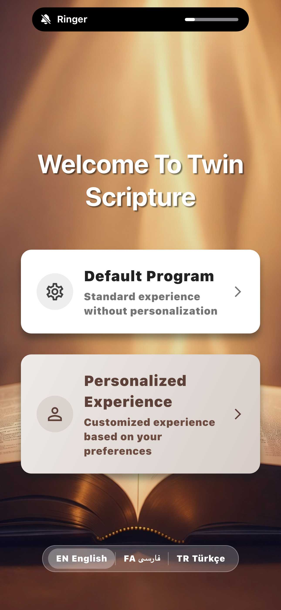
        <p style="margin-top: 8px; font-size: 14px; color: #666; font-weight: 500;">Welcome English</p>
      </td>
      <td style="text-align: center; padding: 10px;">
        
        <p style="margin-top: 8px; font-size: 14px; color: #666; font-weight: 500;">Welcome Persian</p>
      </td>
      <td style="text-align: center; padding: 10px;">
        
        <p style="margin-top: 8px; font-size: 14px; color: #666; font-weight: 500;">Welcome Turkish</p>
      </td>
    </tr>
  </table>
</div>

## Onboarding Flow - Introduction

<div style="overflow-x: auto; border: 3px solid #333; border-radius: 8px; padding: 20px; margin: 25px 0; background-color: #f9f9f9;">
  <table>
    <tr>
      <td style="text-align: center; padding: 10px;">
        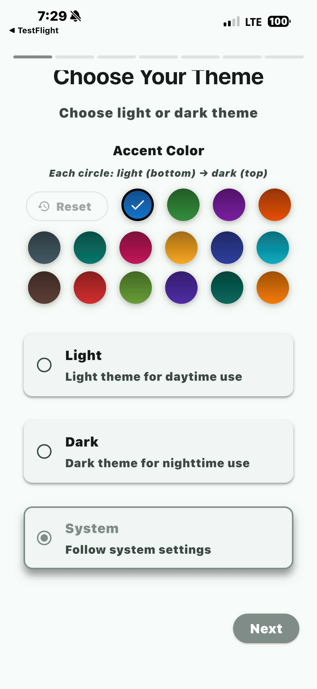
        <p style="margin-top: 8px; font-size: 14px; color: #666; font-weight: 500;">Onboarding 01-01</p>
      </td>
      <td style="text-align: center; padding: 10px;">
        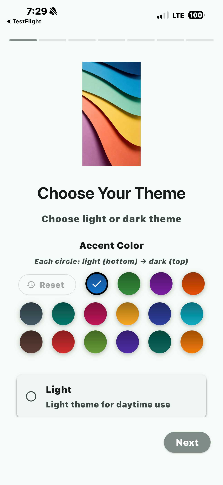
        <p style="margin-top: 8px; font-size: 14px; color: #666; font-weight: 500;">Onboarding 01</p>
      </td>
      <td style="text-align: center; padding: 10px;">
        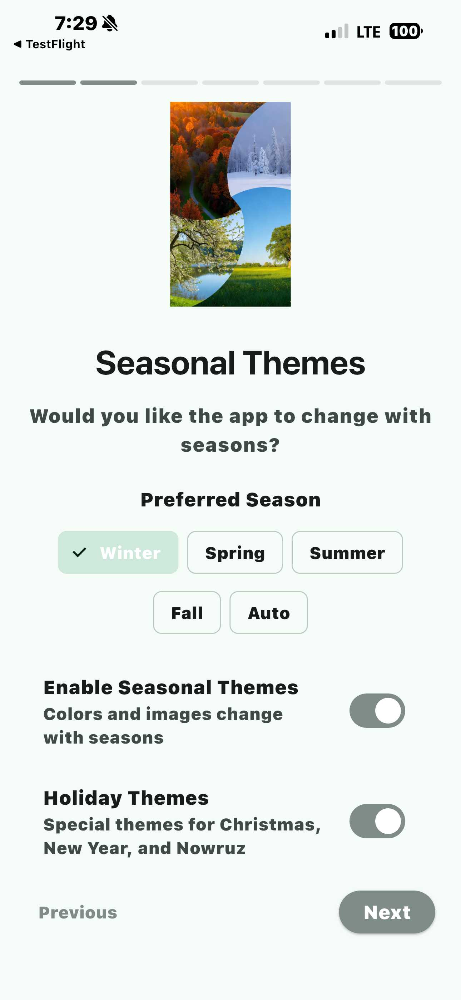
        <p style="margin-top: 8px; font-size: 14px; color: #666; font-weight: 500;">Onboarding 02</p>
      </td>
      <td style="text-align: center; padding: 10px;">
        
        <p style="margin-top: 8px; font-size: 14px; color: #666; font-weight: 500;">Onboarding 03</p>
      </td>
    </tr>
  </table>
</div>

## Visual Preferences - Season Selection

<div style="overflow-x: auto; border: 3px solid #333; border-radius: 8px; padding: 20px; margin: 25px 0; background-color: #f9f9f9;">
  <table>
    <tr>
      <td style="text-align: center; padding: 10px;">
        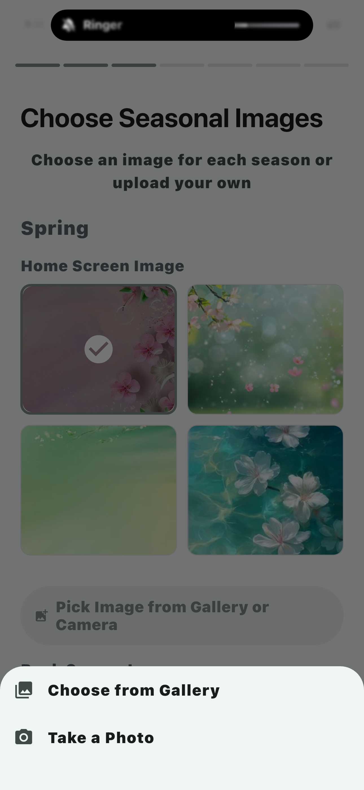
        <p style="margin-top: 8px; font-size: 14px; color: #666; font-weight: 500;">Pick Image</p>
      </td>
      <td style="text-align: center; padding: 10px;">
        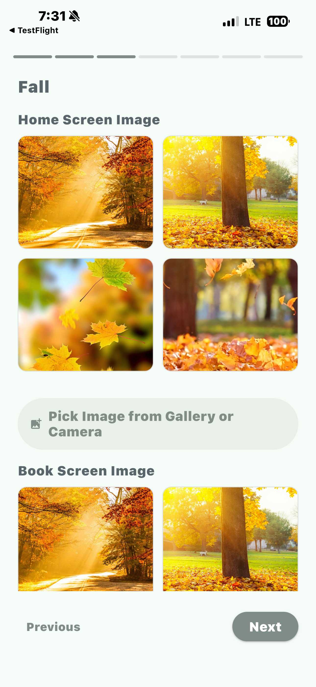
        <p style="margin-top: 8px; font-size: 14px; color: #666; font-weight: 500;">Fall Season</p>
      </td>
      <td style="text-align: center; padding: 10px;">
        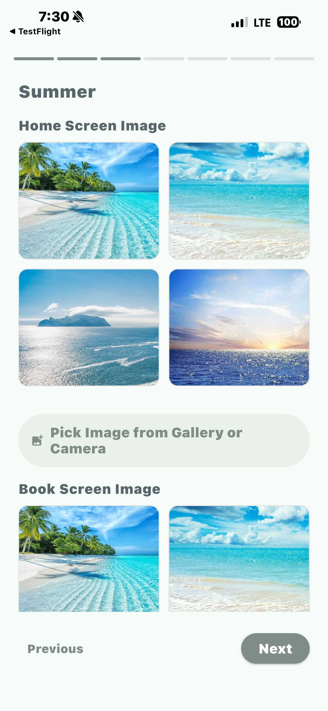
        <p style="margin-top: 8px; font-size: 14px; color: #666; font-weight: 500;">Summer Season</p>
      </td>
      <td style="text-align: center; padding: 10px;">
        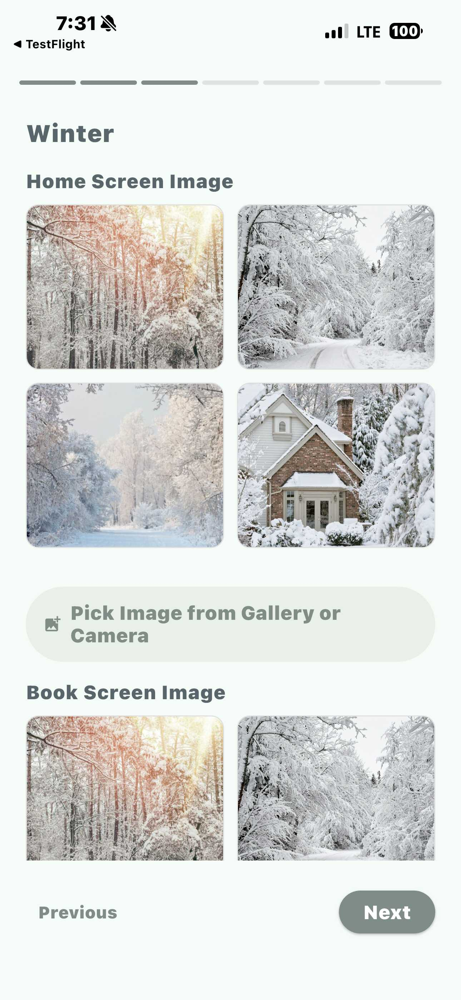
        <p style="margin-top: 8px; font-size: 14px; color: #666; font-weight: 500;">Winter Season</p>
      </td>
    </tr>
  </table>
</div>

## Special Occasions

<div style="overflow-x: auto; border: 3px solid #333; border-radius: 8px; padding: 20px; margin: 25px 0; background-color: #f9f9f9;">
  <table>
    <tr>
      <td style="text-align: center; padding: 10px;">
        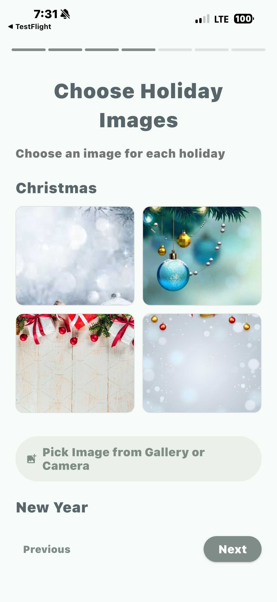
        <p style="margin-top: 8px; font-size: 14px; color: #666; font-weight: 500;">Christmas Theme</p>
      </td>
      <td style="text-align: center; padding: 10px;">
        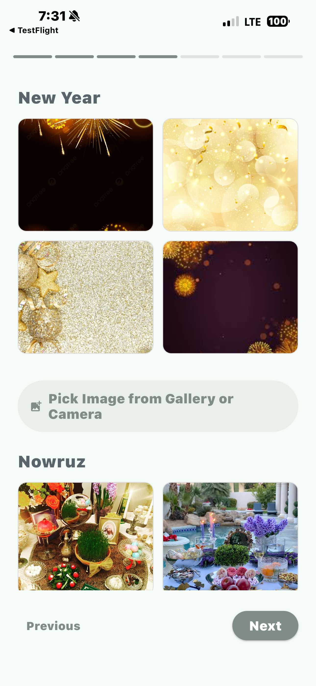
        <p style="margin-top: 8px; font-size: 14px; color: #666; font-weight: 500;">New Year Theme</p>
      </td>
    </tr>
  </table>
</div>

## Emotional Connection & Typography

<div style="overflow-x: auto; border: 3px solid #333; border-radius: 8px; padding: 20px; margin: 25px 0; background-color: #f9f9f9;">
  <table>
    <tr>
      <td style="text-align: center; padding: 10px;">
        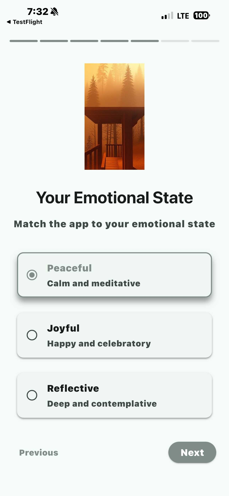
        <p style="margin-top: 8px; font-size: 14px; color: #666; font-weight: 500;">Emotional Selection</p>
      </td>
      <td style="text-align: center; padding: 10px;">
        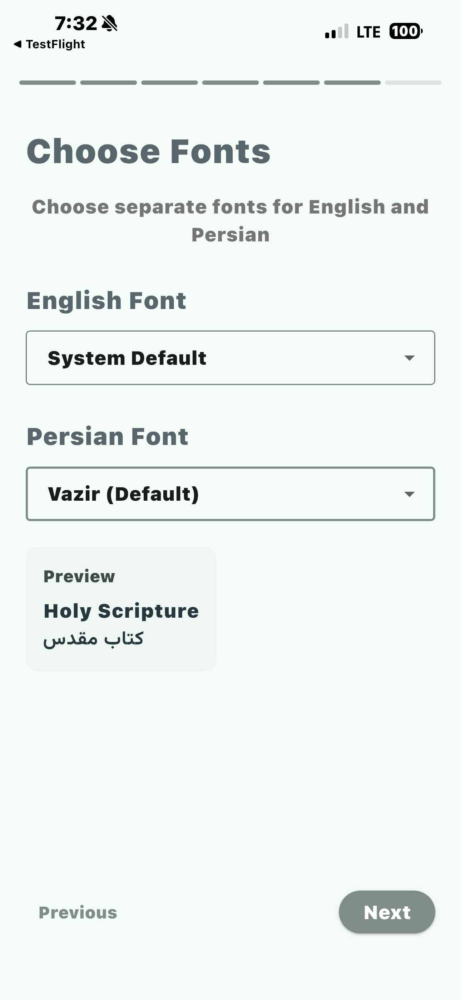
        <p style="margin-top: 8px; font-size: 14px; color: #666; font-weight: 500;">Font Selection</p>
      </td>
      <td style="text-align: center; padding: 10px;">
        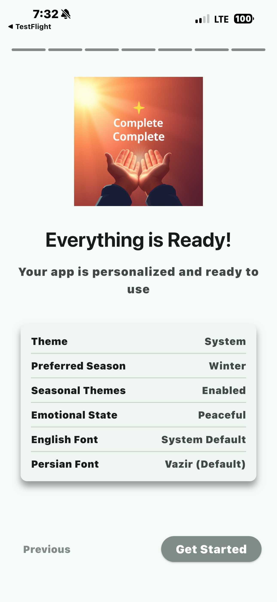
        <p style="margin-top: 8px; font-size: 14px; color: #666; font-weight: 500;">Ready to Begin</p>
      </td>
    </tr>
  </table>
</div>

---

### Home Page Experience

The home page adapts to user preferences, showing seasonal themes and personalized content based on their visual selections.

## Seasonal Themes

<div style="overflow-x: auto; border: 3px solid #333; border-radius: 8px; padding: 20px; margin: 25px 0; background-color: #f9f9f9;">
  <table>
    <tr>
      <td style="text-align: center; padding: 10px;">
        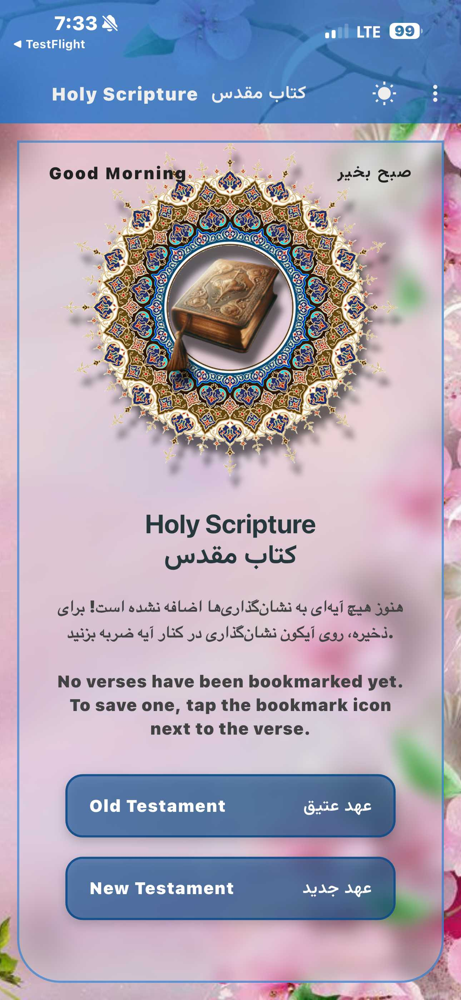
        <p style="margin-top: 8px; font-size: 14px; color: #666; font-weight: 500;">Spring Theme</p>
      </td>
      <td style="text-align: center; padding: 10px;">
        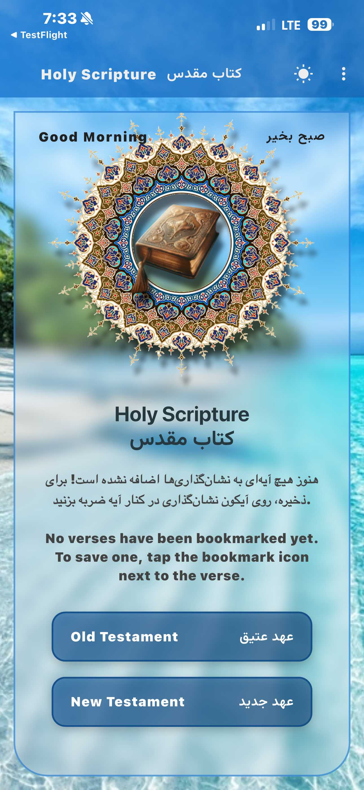
        <p style="margin-top: 8px; font-size: 14px; color: #666; font-weight: 500;">Summer Theme</p>
      </td>
      <td style="text-align: center; padding: 10px;">
        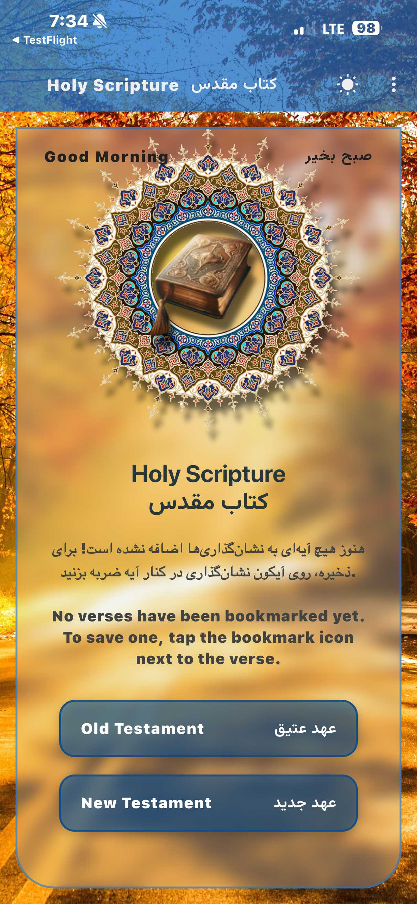
        <p style="margin-top: 8px; font-size: 14px; color: #666; font-weight: 500;">Fall Theme</p>
      </td>
      <td style="text-align: center; padding: 10px;">
        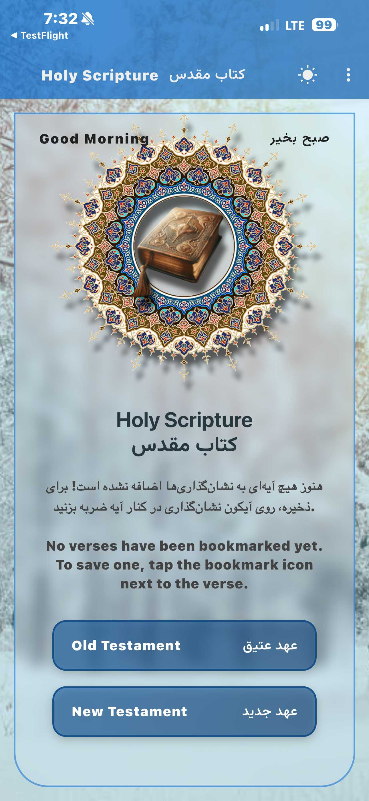
        <p style="margin-top: 8px; font-size: 14px; color: #666; font-weight: 500;">Winter Theme</p>
      </td>
    </tr>
  </table>
</div>

## Navigation & Features

<div style="overflow-x: auto; border: 3px solid #333; border-radius: 8px; padding: 20px; margin: 25px 0; background-color: #f9f9f9;">
  <table>
    <tr>
      <td style="text-align: center; padding: 10px;">
        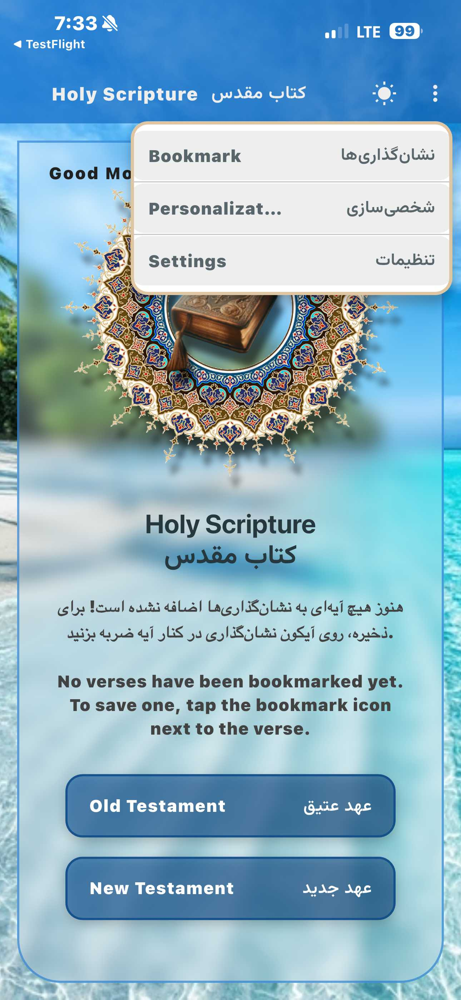
        <p style="margin-top: 8px; font-size: 14px; color: #666; font-weight: 500;">Dropdown Menu</p>
      </td>
    </tr>
  </table>
</div>

---

### Reading Experience

## Book Selection

<div style="overflow-x: auto; border: 3px solid #333; border-radius: 8px; padding: 20px; margin: 25px 0; background-color: #f9f9f9;">
  <table>
    <tr>
      <td style="text-align: center; padding: 10px;">
        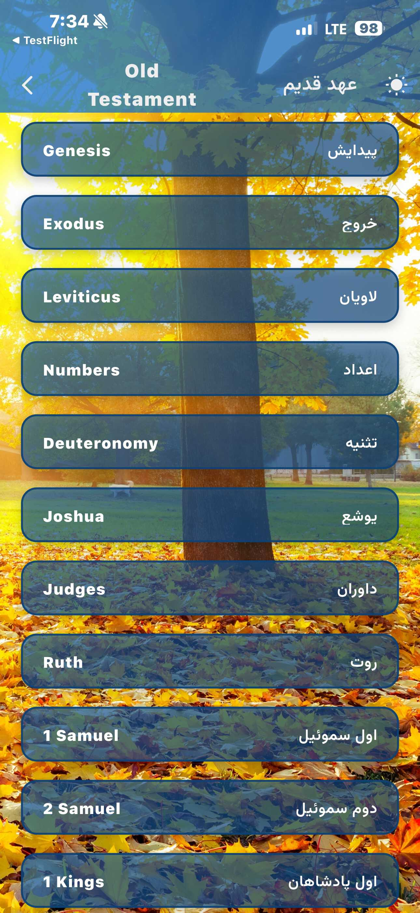
        <p style="margin-top: 8px; font-size: 14px; color: #666; font-weight: 500;">Book Page</p>
      </td>
    </tr>
  </table>
</div>

## Verse Reading

<div style="overflow-x: auto; border: 3px solid #333; border-radius: 8px; padding: 20px; margin: 25px 0; background-color: #f9f9f9;">
  <table>
    <tr>
      <td style="text-align: center; padding: 10px;">
        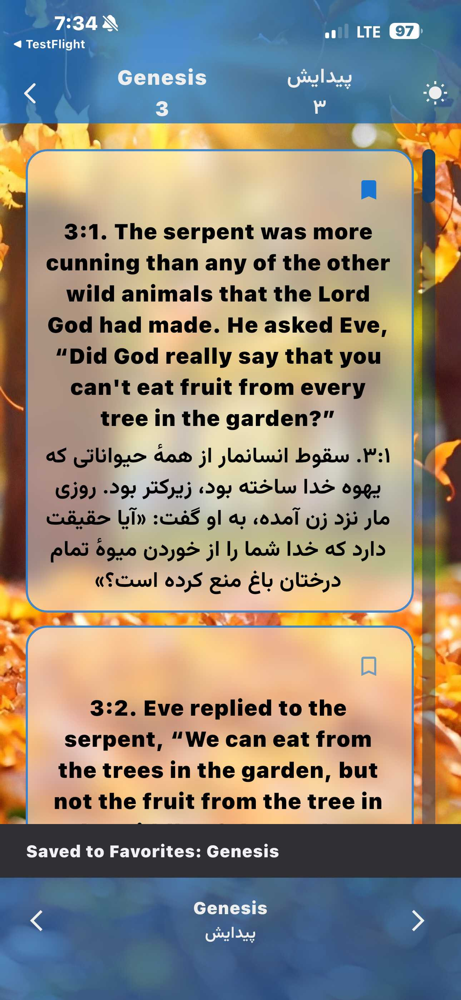
        <p style="margin-top: 8px; font-size: 14px; color: #666; font-weight: 500;">Verse Page</p>
      </td>
      <td style="text-align: center; padding: 10px;">
        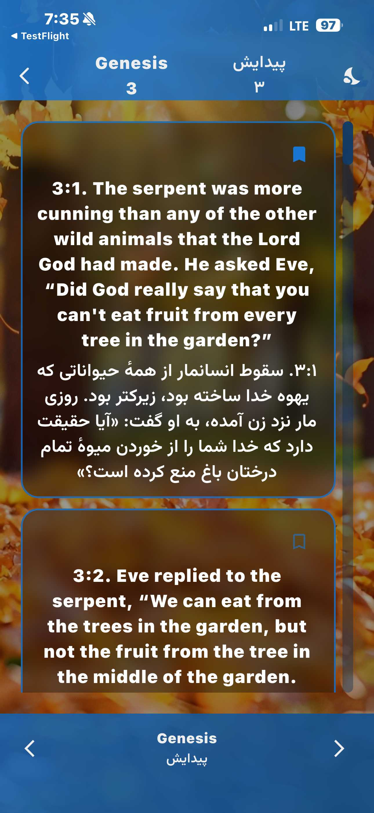
        <p style="margin-top: 8px; font-size: 14px; color: #666; font-weight: 500;">Verse Page Dark Mode</p>
      </td>
    </tr>
  </table>
</div>

---

### Personalization Features

## Bookmarks

<div style="overflow-x: auto; border: 3px solid #333; border-radius: 8px; padding: 20px; margin: 25px 0; background-color: #f9f9f9;">
  <table>
    <tr>
      <td style="text-align: center; padding: 10px;">
        
        <p style="margin-top: 8px; font-size: 14px; color: #666; font-weight: 500;">Bookmark Page</p>
      </td>
      <td style="text-align: center; padding: 10px;">
        
        <p style="margin-top: 8px; font-size: 14px; color: #666; font-weight: 500;">Bookmark Delete Option</p>
      </td>
    </tr>
  </table>
</div>

---

## Design Principles

### 1. **Visual First**
Every preference is presented visually. Users see what they're choosing, not just read about it.

### 2. **Minimal Friction**
No lengthy forms. Just select what you like and continue.

### 3. **Emotional Connection**
Design choices reflect moods, seasons, and personal feelings - things users can relate to instantly.

### 4. **Respectful of Time**
Quick selections that feel like exploration, not interrogation.

### 5. **Inclusive & Accessible**
Multi-language support and clear visual hierarchy ensure everyone can personalize their experience.

---

## Technical Implementation

This Flutter application implements these design principles through:

- **Dynamic Theme Management**: Seasonal and preference-based theming
- **Image Selection Grids**: Visual preference selection components
- **Animated Transitions**: Smooth, engaging user flows
- **Responsive Design**: Adapts beautifully across device sizes
- **Dark Mode Support**: Comfortable reading in any lighting condition

---

## Why This Approach Works

1. **Faster Onboarding**: Users complete personalization in minutes, not hours
2. **Higher Engagement**: Visual choices are more engaging than text forms
3. **Better Recall**: Users remember their choices because they saw them
4. **Reduced Abandonment**: Less friction means more completed setups
5. **Emotional Connection**: Visual preferences create stronger emotional bonds with the app

---

## Project Structure

```
lib/
├── features/
│   └── onboarding/
│       └── presentation/
│           └── screen/
│               └── onboarding_flow.dart
├── core/
│   ├── models/
│   │   └── user_preferences.dart
│   ├── themes/
│   │   └── dynamic_theme_manager.dart
│   └── widgets/
│       ├── animated_gradiant_scaffold.dart
│       ├── chapter_button.dart
│       └── image_selection_grid.dart
└── main_page.dart
```

---

## Getting Started

This project is built with Flutter. To get started:

1. Clone the repository
2. Install Flutter dependencies: `flutter pub get`
3. Run the app: `flutter run`

---

## Design Assets

All product design images are located in `assets/images/product-design/` and showcase the complete user experience from onboarding through daily use.

---

*"Show me what you like, don't tell me in a form."* - This is the philosophy that guides every design decision in Twin Scriptures.
